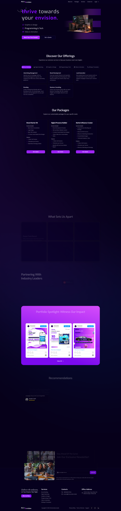

# 🚀 Thrivenvision – Digital Services Website

  
*A clean, responsive, and scalable website for a modern digital service provider.*

Thrivenvision is a professional web platform designed for a digital services company. Built with **Next.js App Router**, **Tailwind CSS**, and **Firebase**, this application allows users to explore service packages, submit quote requests, and schedule consultations. It also features an admin dashboard for managing portfolio items, pricing, and consultation responses.

---

## 🌍 Live Site

🔗 [https://www.thrivenvision.studio/](https://www.thrivenvision.studio/)

---

## 📸 Screenshots

| Homepage | About Us | Our Packages |
|----------|------------------|-------------------|
|  |  |  |

---

## ✨ Features

- ⚡ **Next.js App Router** for optimized routing and performance
- 🎨 **Tailwind CSS + Shadcn UI** for fast, responsive design
- 🔐 **Firebase Authentication** for secure login
- 📂 **Firestore & Firebase Storage** to manage content and files
- 📋 **React Hook Form + Zod** for form handling and validation
- 🎞️ **Framer Motion** for elegant scroll animations and transitions
- 🧑‍💼 **Admin Dashboard** to:
  - Add/edit/delete portfolio posts
  - View/manage consultation requests
  - Update pricing and service packages
- 📱 Fully responsive across all devices

---

## 🛠 Tech Stack

- **Framework:** [Next.js](https://nextjs.org/) (App Router)
- **Language:** TypeScript
- **Styling:** Tailwind CSS, Shadcn UI
- **Database:** Firebase Firestore
- **Storage:** Firebase Storage
- **Forms:** React Hook Form, Zod
- **Animation:** Framer Motion
- **Auth:** Firebase Auth
