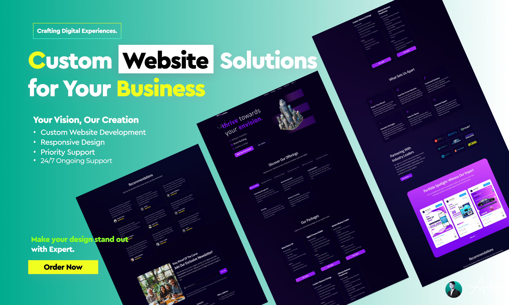
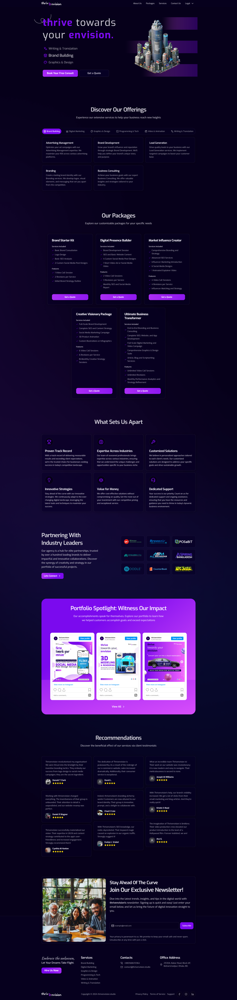
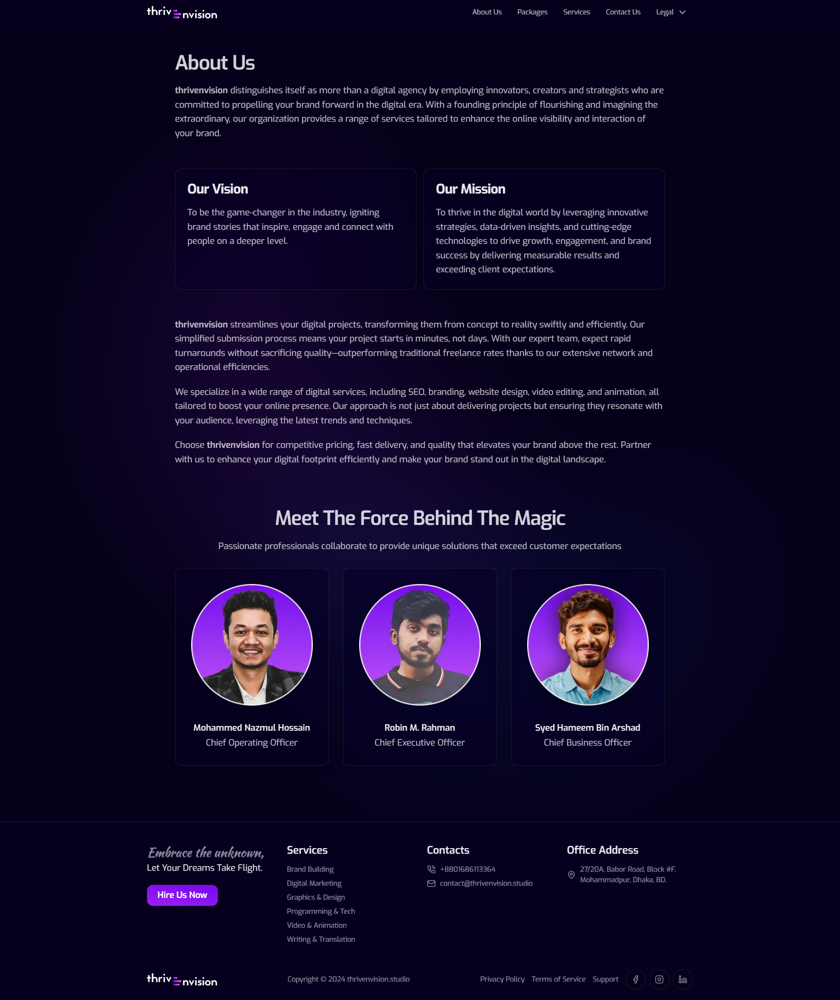
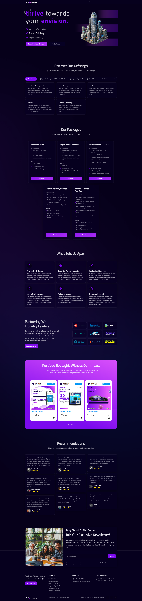

# 🚀 Thrivenvision – Digital Services Website

  

*A sleek, responsive, and high-performance frontend crafted for modern digital service experiences.*

Thrivenvision is a web platform designed for a creative digital services agency. This project focuses on delivering a seamless, engaging, and scalable **frontend experience**, built using the power of **Next.js (App Router)** and styled with **Tailwind CSS** and **Shadcn UI**. 

It empowers users to explore service offerings, request quotes, and schedule consultations—while the backend supports a flexible dashboard to manage content like portfolios, pricing, and contact requests.

> The project is not just a site—it's a frontend architecture optimized for performance, maintainability, and user-centered design.

---

## 🌐 Live Site

👉 **[Visit Thrivenvision Studio](https://www.thrivenvision.studio/)**

---

## 📸 Screenshots

Here’s a quick visual overview of the interface:

<table>
  <tr>
    <td><strong>Homepage</strong></td>
    <td><strong>About Us</strong></td>
    <td><strong>Our Packages</strong></td>
  </tr>
  <tr>
    <td></td>
    <td></td>
    <td></td>
  </tr>
</table>

---

## ✨ Key Frontend Features

- ⚡ **Next.js App Router:** Utilizes the latest routing structure with enhanced loading, layout, and caching strategies.
- 🎨 **Tailwind CSS + Shadcn UI:** Offers consistent styling, accessibility, and pixel-perfect responsiveness across screens.
- 🎞️ **Framer Motion:** Adds elegant scroll-based and page transition animations for a smooth user experience.
- 📋 **React Hook Form + Zod:** Enables flexible form handling with strong schema-based validation.
- 🔐 **Firebase Auth:** Manages secure authentication and protected routes for admin access.
- 🧑‍💼 **Admin Dashboard (Frontend-driven):**
  - Manage portfolios and media content
  - Add, update, or remove pricing packages
  - View and reply to consultation requests

---

## 🧠 Frontend Architecture Philosophy

This project is built with a **component-first mindset**, leveraging modern hooks, reusable UI logic, and scalable design systems. By combining powerful libraries like Shadcn and Tailwind, the UI remains cohesive yet flexible—perfect for growing digital brands.

The structure promotes:
- **Code reusability** through modular components
- **Performance-first rendering** via server-side strategies
- **Responsive interactivity** to engage users on all devices

---

## 🛠 Tech Stack

| Category         | Tools Used                                 |
|------------------|---------------------------------------------|
| **Framework**    | [Next.js (App Router)](https://nextjs.org/) |
| **Language**     | TypeScript                                  |
| **Styling**      | Tailwind CSS, Shadcn UI                     |
| **Database**     | Firebase Firestore                          |
| **Storage**      | Firebase Storage                            |
| **Auth**         | Firebase Authentication                     |
| **Forms**        | React Hook Form, Zod                        |
| **Animation**    | Framer Motion                               |

---

## 🧑‍💻 About the Developer

Crafted with care by [Jaman Ador](https://jamanador.web.app/)  
🔗 [Connect on LinkedIn](https://www.linkedin.com/in/jamanador/)  
💼 Frontend Specialist • UI/UX Designer • Web App Developer

---